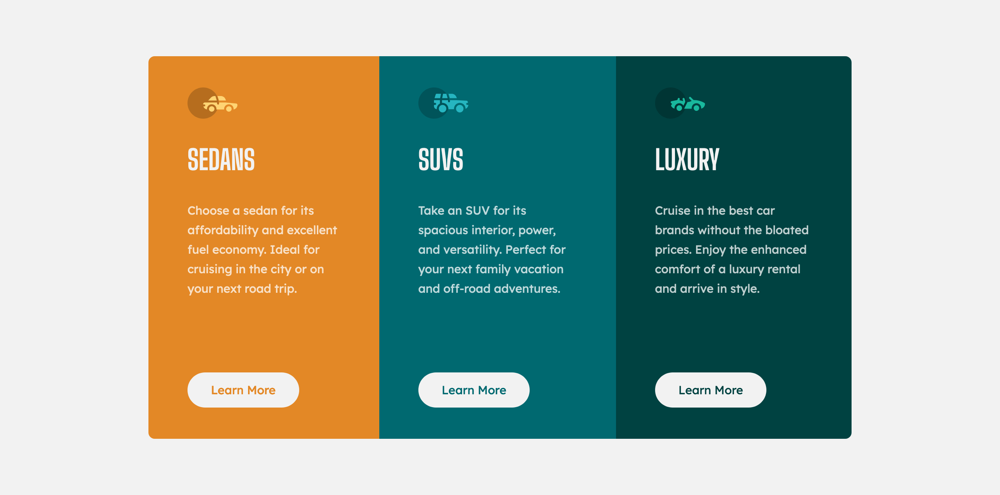

# 3-columns preview card component solution

**Hi everyone 👋 !**

I come back again with another solution for a [FrontendMentor](https://www.frontendmentor.io) challenge.

## Table of contents

- [Overview](#overview)
  - [The challenge](#the-challenge)
  - [Screenshots](#screenshots)
  - [Links](#links)
- [My process](#my-process)
  - [Built with](#built-with)
- [Author](#author)

## Overview

### The challenge

This time, it's about making a **3-columns preview card**. You can see the challenge [here](https://www.frontendmentor.io/challenges/stats-preview-card-component-8JqbgoU62).

### Screenshot

This is the solution for desktop screens:

And this is for mobile screens:

### Links

Here's the URL of my solution: https://musread.github.io/3-column-preview-card-component/

## My process

### Built with

- Semantic HTML5 markup
- CSS custom properties
- Flexbox
- Node packages : [SCSS](https://www.npmjs.com/package/node-sass)

### Useful resources

- [MDN : Adding vector images](https://developer.mozilla.org/en-US/docs/Learn/HTML/Multimedia_and_embedding/Adding_vector_graphics_to_the_Web) - I needed it to know how to incorporate SVG images into HTML.

## Author

- GitHub profile - https://github.com/Musread
- Frontend Mentor profile - [@musread](https://www.frontendmentor.io/profile/musread)
